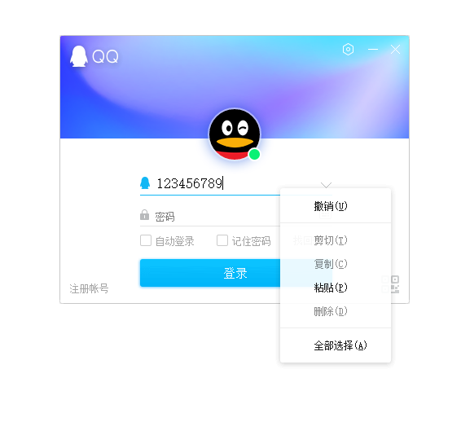

在Archlinux及衍生发行版上运行QQ
========

<p align="center">
  <a href="https://travis-ci.org/countstarlight/deepin-wine-qq-arch">
    
  </a>
  <a href="https://im.qq.com/download/">
    
  </a>
  <a href="https://aur.archlinux.org/packages/deepin-wine-qq/">
    
  </a>
  <a href="https://github.com/countstarlight/deepin-wine-qq-arch/issues">
    
  </a>
</p>

Deepin打包的QQ容器移植到Archlinux，不依赖`deepin-wine`，包含定制的注册表配置，QQ安装包替换为官方最新

<!-- TOC -->

- [安装](#安装)
    - [从AUR安装](#从aur安装)
    - [从GitHub Release 安装](#从github-release-安装)
    - [从源码安装](#从源码安装)
- [字体](#字体)
    - [使用其他字体](#使用其他字体)
    - [修复字体模糊](#修复字体模糊)
- [常见问题](#常见问题)
- [感谢](#感谢)
- [更新日志](#更新日志)

<!-- /TOC -->

## 安装

`deepin-wine-qq`依赖`Multilib`仓库中的`wine`，`wine_gecko`和`wine-mono`，Archlinux默认没有开启`Multilib`仓库，需要编辑`/etc/pacman.conf`，取消对应行前面的注释([Archlinux wiki](https://wiki.archlinux.org/index.php/Official_repositories#multilib)):

```diff
# If you want to run 32 bit applications on your x86_64 system,
# enable the multilib repositories as required here.

#[multilib-testing]
#Include = /etc/pacman.d/mirrorlist

-#[multilib]
-#Include = /etc/pacman.d/mirrorlist
+[multilib]
+Include = /etc/pacman.d/mirrorlist
```

### 从AUR安装

已添加到AUR [deepin-wine-qq](https://aur.archlinux.org/packages/deepin-wine-qq/)，可使用 `yay` 或 `yaourt` 安装:

```shell
yay -S deepin-wine-qq
```

### 从GitHub Release 安装

> 由[Travis CI](https://travis-ci.org/countstarlight/deepin-wine-qq-arch)在Docker容器[mikkeloscar/arch-travis](https://hub.docker.com/r/mikkeloscar/arch-travis)中自动构建的ArchLinux安装包

在[GitHub Release](https://github.com/countstarlight/deepin-wine-qq-arch/releases)页面下载 `.pkg.tar.xz`后缀的安装包，使用`pacman`安装：

```bash
sudo pacman -U #下载的包名
```

### 从源码安装

```shell
 git clone https://github.com/countstarlight/deepin-wine-qq-arch.git

 cd deepin-wine-qq-arch
  
 makepkg -si
```

* 运行开始菜单中创建的QQ快捷方式，开始安装QQ

* 安装完可直接启动

* **前几次运行时可能会提示 "qq安全组件异常"，等一会再运行或重启一下系统**

## 字体

### 使用其他字体

默认使用文泉驿微米黑(`wqy-microhei`)字体，目前有字体虚化、模糊问题，可以使用Windows平台常用字体替代，直接将字体文件或字体链接文件放置到字体文件夹就会生效，不会影响系统字体

字体文件夹在：`$HOME/.deepinwine/Deepin-QQ/drive_c/windows/Fonts`

Windows 10自带字体及版本：<https://docs.microsoft.com/en-us/typography/fonts/windows_10_font_list>

* 中易宋体(SimSun)：`simsun.ttf` 或 `simsun.ttc`，图为SimSun, Regular：

  

* 微软雅黑(Microsoft YaHei)：`msyh.ttf`或`msyh.ttc`，图为Microsoft YaHei, Regular：

  

  Microsoft YaHei, Bold：

  

* (繁体)细明体(MingLiU)：`mingliu.ttf` 或 `mingliu.ttc`

* (繁体)新细明体(PMingLiU)：`pmingliu.ttf` 或 `pmingliu.ttc`

### 修复字体模糊

参见：[deepin-wine-tim-arch#修复字体模糊](https://github.com/countstarlight/deepin-wine-tim-arch#%E4%BF%AE%E5%A4%8D%E5%AD%97%E4%BD%93%E6%A8%A1%E7%B3%8A)
## 常见问题

- [ ] 1.不能视频通话
- [ ] 2.不能记住密码
- [ ] 3.网络连接状态改变后不能重连: [issue19](https://github.com/countstarlight/deepin-wine-tim-arch/issues/19)
- [x] 4.解决在 2k/4k 屏幕下字体和图标都非常小, 参见[issue1](https://github.com/countstarlight/deepin-wine-tim-arch/issues/1)
- [x] 5.使用全局截图快捷键和解决Gnome上窗口化问题，参见[issue2](https://github.com/countstarlight/deepin-wine-tim-arch/issues/2)

## 感谢

* [Wuhan Deepin Technology Co.,Ltd.](http://www.deepin.org/)


* [@wszqkzqk](https://github.com/wszqkzqk) 的 [wszqkzqk-deepin-wine-tim-arch](https://github.com/wszqkzqk/wszqkzqk-deepin-wine-tim-arch)

* [@ssfdust](https://github.com/ssfdust) 的 [wszqkzqk-deepin-wine-tim-arch](https://github.com/ssfdust/wszqkzqk-deepin-wine-tim-arch)

## 更新日志

* 2019-04-19 QQ-9.1.1.24953
* 2019-03-18 QQ-9.1.0.24712
* 2019-03-06 QQ-9.0.9.24445
* 2019-02-05 QQ-9.0.9_1
* 2017-12-31 QQ-8.9.6

